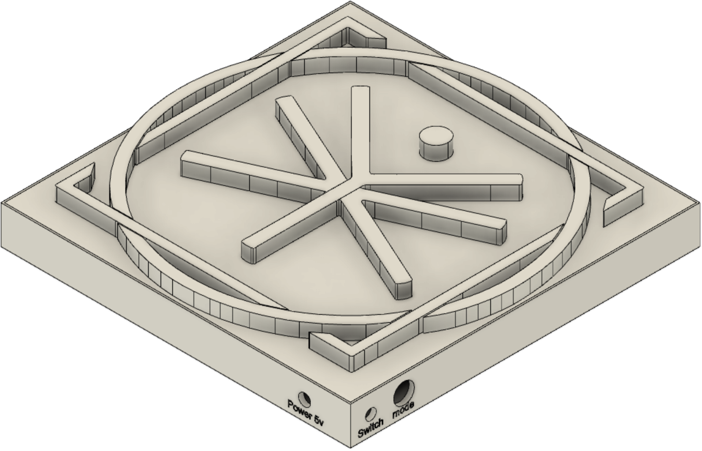

# wallClockLED
A project started during the second lock down in France, for "L'Exploratoire" as a gift.

This project consists in a 3D printed wall decoration, and a RGB LED strip to light the decoration from inside.

The FastLED library is used in this project.

Here is a picture of the design. (I hope there will few revisions after printing)

For now, I have no idea what to display, other than a clock.

• A switch lever is used to switch on and off the power, [like this](https://www.conrad.fr/p/interrupteur-a-levier-1-x-onoffon-apem-5537a-250-vac-3-a-momentane0momentane-1-pcs-700351?gclid=Cj0KCQiA2af-BRDzARIsAIVQUOekeoTQ4VcVF-D4-ZMJnVirvH8C8w9s2xa3Ih5uuZjns6vQAjkLi3AaAsD3EALw_wcB&gclsrc=aw.ds&vat=true)

• A momentary switch is used to switch between the modes, [like this](https://fr.aliexpress.com/item/32711610388.html?src=google&albch=shopping&acnt=248-630-5778&isdl=y&slnk=&plac=&mtctp=&albbt=Gploogle_7_shopping&aff_atform=google&aff_short_key=UneMJZVf&gclsrc=aw.ds&&albagn=888888&&ds_e_adid=438856512718&ds_e_matchtype=&ds_e_device=c&ds_e_network=u&ds_e_product_group_id=743612850714&ds_e_product_id=fr32711610388&ds_e_product_merchant_id=107740078&ds_e_product_country=FR&ds_e_product_language=fr&ds_e_product_channel=online&ds_e_product_store_id=&ds_url_v=2&ds_dest_url=https://fr.aliexpress.com/item/32711610388.html?&albcp=10191220514&albag=107473525128&gclid=Cj0KCQiA2af-BRDzARIsAIVQUOe-GdFYVys44eTIaCQtmQHlYHUX3IlIBd3vqw184R-cE-Zmsk4w8lYaAmqmEALw_wcB)
